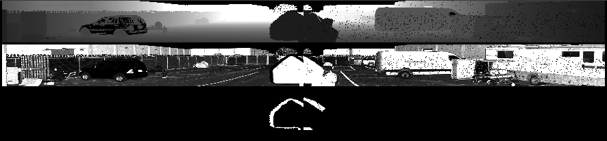
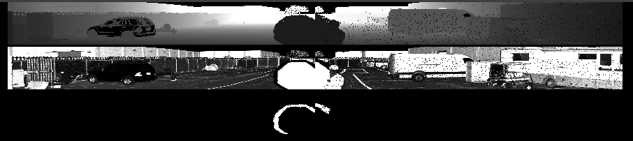

# Bloom Filter

## Introduction

Hello wonderful candidate, it's great to meet you!

Presented here is a problem similar in nature to ones often faced at Luminar. It is also a problem for which simple solutions can be quickly prototyped.

Most LiDAR systems suffer from a blooming or ringing artifact around bright targets like retro-reflective traffic signs. For this project we have captured two LiDAR point clouds which contain some amount of blooming. The first blooms around a pedestrian crossing sign, and the second around a stop sign, see the images below.

The first row of each image is the X dimension of the point cloud, normalized between 0 and 50m, the second row is the intensity of the LiDAR return, normalized between 0 and 500 (about 25% reflective), and the third row is the labeled bloom surrounding the sign.

One can observe that bloomed pixels are typically very un-reflective, and surround a large collection of highly reflective returns.

## Challenge

We have implemented a simple bloom filter for you in `filter.cpp`. This code classifies a point as bloom/not-bloom based on the number of high and low intensity neighbors for a given point. To successfully complete the challenge we would like you to optimize the given code. Everything is on the table: data structure/memory optimization, parallelization, vector operations, multi-threading, be creative!

If you have any challenge understanding the current code please quickly let us know.

We have attached several files to get you started:

### Data

`crossingsign_10hz_0.xyz` and `fullstopsign_10hz_0.xyz`

These are csv files with the following fields:
1. X position in the point cloud
2. Y position in the point cloud
3. Z position in the point cloud
4. Intensity of the point
  4a. Values for normal returns range from 0-2047 (0-100%)
  4b. Values for retroreflectors range from 2048 to 4095
5. Index of the point in the cloud
  5a. The points should be in row-major order, viewed as an image there will be `64` rows and `1000` columns
6. Don't bother with this column
7. Binary label. True positive blooming implies label = 1

### Visualization

- `viz.py` is a simple python script to recreate the images in this README
- Note that this script requires opencv and numpy to run

### Preliminary Code

- `filter.cpp` contains basic implementation of a bloom filter
- `CMakeLists.txt` is a basic CMake file to build the executable
- The prototype should build into a program that can be run like `./bloom_filter <path>`

## Deliverables

1. The `loadCSV` and `filter` function prototypes should be optimized. For extra credit, evaluate your filter by implementing the `computeRecall` and `computePrecision` for this binary classification problem.
2. An evaluation of the runtime performance of your implementation, including potential future optimizations.
3. A short report, if you were to integrate this filter into a production pipeline, how would you structure / organize the codebase.

## Notes

- If you would like to use a third party library, e.g. for accelerated numerical processing, that is acceptable. But please send us your updated CMake file
- If you would like to refactor the given function prototypes or data structures into a more viable/performant solution, feel free, we will be impressed!
- If you have any questions, please let us know quickly
